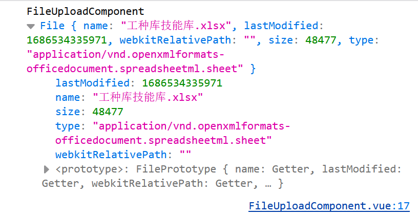

# 前端文件上传 & 文件相关操作
## 前置知识
*  上传方式
1.  二进制blob传输 => 用formData搭载file，从而使得文件可以从前端传递给后端
2. base64传输 - 后端需要解析  <- 通过fileReader将文件转化为base64再传递给后端

* 与文件相关的对象
1. file => 通过input标签读过来的文件对象，本质上是blob的子类，但无法直接把file给后端，因此需要一个前后端都认识的东西 => formData
2. blob => 不可变的二进制内容，包含很多操作方法
3. formData => 用于和后端传输的对象
4. fileReader => 多用于把文件读取为某种形式，比如base64/text文本


## 代码
### 单文件上传 & 分片上传
```js
<template>
  <div>
    <input type="file" name="file" @change="fileChange" >
    <button @click="submit">提交</button>
  </div>
</template>

// 通过e.target.files能拿到上传后的文件数组
fileChange(e) {
  console.log('FileUploadComponent', e.target.files)
  // 单个文件上传默认取第一个就可以了
    {/* console.log('FileUploadComponent', e.target.files[0]) */}
},
```

* 当我们上传单个文件后，就能拿到该文件的信息，特别注意name，size，type
* 实际开发中，我们有可能会有各种的需求，比如说限制文件的大小(size), 文件的类型(type/name)，
* 文件的切割，我们可以把得到的file对象转化成blob对象，并利用blob的slice方法对原文件进行切割
```js


```
* 通过fileReader可以做缩略图，文本预览
缩略图 =>      FR.readAsDataURL(slice_file);
文本预览 =>       FR.readAsText(slice_file);

### 多文件上传
```js
      // 切片上传 - 单文件为例
      // 对文件进行切片
      // fileObj 为 获取到的文件实例
      // 切片上传 - 单文件为例
      // 对文件进行切片
      // fileObj 为 获取到的文件实例
      const fileSize = fileObj.size;
      const limitSize = 10 * 1024;
      let currentSize = 0;

      while (currentSize < fileSize) {
        // 用formData加载，同时并给他追加名字以便后端识别，后端根据名字拼接到一起
        const _formData = new FormData()
        _formData.append(fileObj.name, fileObj.slice(currentSize, currentSize + limitSize))
        await fileUploadService(
          _formData
        );
        currentSize += limitSize;
        // 超过100， 取100
        this.percentage = Math.min((currentSize / fileSize) * 100, 100);
      }
```


### 断点续传
```js
      const fileSize = fileObj.size;
      const limitSize = 10 * 1024;


      // 这里通过对currentSize进行持久化，下次就能知道上次的进度
      let currentSize = localStorage.setItem(fileObj.name, currentSize) || 0;
      localStorage.setItem(fileObj.name, currentSize)


      while (currentSize < fileSize) {
        const _formData = new FormData()
        _formData.append(fileObj.name, fileObj.slice(currentSize, currentSize + limitSize))
        await fileUploadService(
          _formData
        );
        currentSize += limitSize;
        this.percentage = Math.min((currentSize / fileSize) * 100, 100);
      }
```
